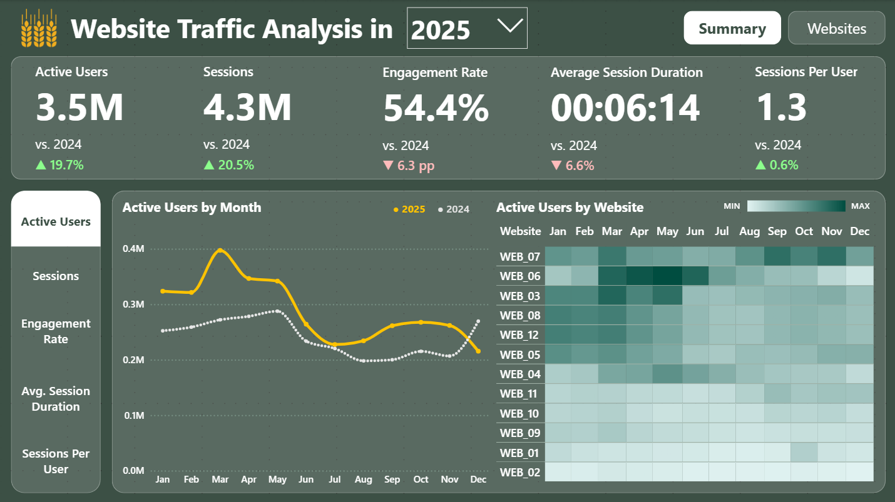
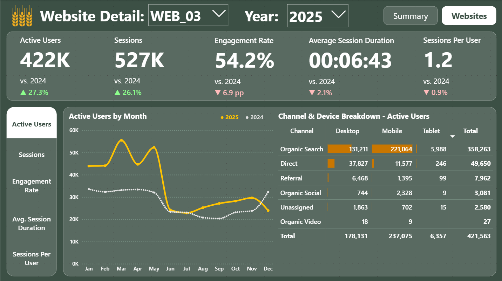

# GA4 Data Pipeline & BI Reporting

## 📌 Quick Links & Live Demos
Check out the final results directly
* 📊 **[Interactive Power BI Dashboard](https://mavenshowcase.com/project/56439)**
* 📁 **[Explore the Python ETL Scripts](./notebooks/)**

---

## 📖 Project Overview
This project demonstrates an end-to-end automated analytics solution, bypassing the limitations of the native Google Analytics 4 (GA4) interface. It extracts raw web traffic data across multiple domains via the GA4 API, processes it into a clean tabular format using Python, and feeds it into a highly dynamic, UX-optimized Power BI dashboard.

**The Challenge:** Relying on the standard GA4 web interface for multi-property reporting is manual, slow, and limits custom calculations. The goal was to build a scalable ETL pipeline that automatically fetches high-cardinality data, handles edge cases in data types, and provides a "Single Source of Truth" dashboard for immediate business insights.

### 🎯 Core Objectives:
1. **Automate Data Extraction:** Connect to the GA4 Data API to fetch custom dimensions and metrics across multiple websites.
2. **Robust Data Transformation:** Cleanse JSON responses, enforce strict data typing, and engineer new analytical features using `pandas` and `numpy`.
3. **Design a Star Schema:** Model the transformed data in Power BI with a dedicated Calendar dimension for scalable reporting.
4. **Develop Custom Time Intelligence:** Write advanced DAX to handle "Latest Data State" logic without relying on standard time functions.
5. **Optimize Dashboard UX:** Implement advanced Power BI storytelling techniques, including Bookmarks and Report Page Tooltips.

---

## 📸 Final Output Preview
Here is a snapshots of the final reporting layer built on top of the transformed data model.    
**Main Canvas**

**Granular Deep-Dive**

You can find all the DAX measures used here:    
👉 **[View the DAX code](./power_bi/dax_code.csv)**

---

## 🏗️ Solution Architecture & Python ETL Pipeline

### Phase 1: GA4 Data Extraction (`1_data_download.ipynb`)
**Goal:** Automate the process of fetching key performance metrics from the GA4 Data API for a list of specified websites.

**Process:**
1. **Authentication:** Securely connects to the Google Analytics API using a service account.
2. **Configuration:** Loads a list of website property IDs from an external JSON file.
3. **Data Fetching:** Iterates through each website ID, sending a request to the API for a predefined set of dimensions and metrics within a specified date range.
4. **Output:** For each website, the raw data is processed from the API response object into a clean list of dictionaries and saved as a separate JSON file in a designated output directory.

*Final Output:* A collection of JSON files, each named after its corresponding website, containing the raw analytics data.

### Phase 2: Data Processing & Preparation (`2_data_processing.ipynb`)
**Goal:** Process the raw JSON files downloaded from the API. The script transforms the raw data into a single, clean, and analysis-ready dataset suitable for visualization in Power BI.

**Process (Transform & Load):**
1. **Load Data:** Iterates through all downloaded JSON files.
2. **Initial Transformation:** * Creates a pandas DataFrame.
   * Renames columns from `camelCase` to database-friendly `snake_case`.
   * Explicitly converts all columns to their appropriate data types (e.g., parsing `userEngagementDuration` to float).
3. **Feature Engineering:**
   * Creates a primary `date` column (datetime type) from the original `year` and `month` columns.
   * Calculates new key performance indicators (KPIs) using vectorized `numpy.divide` for safe zero-division handling:
     * `engagement_rate`: To measure the quality of user sessions.
     * `new_users_ratio`: To measure audience growth.
4. **Data Aggregation:**
   * Extracts the source website domain (`.cz`, `.sk`) from each filename using Regular Expressions (`re`) and adds it as a `website` column.
   * Concatenates all individual DataFrames into a single master DataFrame efficiently.
5. **Final Output:** Saves the master dataset as a clean **CSV** file ready for BI ingestion.
* *(Explore the notebooks in the [notebooks](./notebooks/) folder).*

---

## 📊 Data Modeling & Advanced DAX (Power BI)

### 1. Data Modeling
* **Measure Organization:** Abstracted all DAX calculations into a dedicated `_Key Measures` table for clean model architecture and maintainability.

### 2. Advanced DAX Analytics
* **Custom Time Intelligence:** Engineered DAX measures using variables (`VAR`) and `MAX('Calendar'[Year])` to automatically default the report to the most recent available year.
* **Smart KPIs:** Implemented dynamic thresholding for YoY (Year-over-Year) indicators using `SWITCH` and `UNICHAR` symbols (▲/▼), ensuring the dashboard only highlights practically significant thresholds.

### 3. Data Visualization & UX
* **Metric Switching via Bookmarks:** Deliberately utilized Bookmarks over Field Parameters to allow perfect customization of Y-axis formatting and chart types when toggling between vastly different metrics (e.g., percentages vs. time durations).
* **Contextual Tooltips:** Developed custom Report Page Tooltips containing micro-charts to provide immediate drill-down context (e.g., channel breakdowns) without crowding the main canvas.
* *(Explore the report in the [power_bi](./power_bi/) folder).*

*Note: To ensure confidentiality and protect sensitive business assets, all data presented in this portfolio dashboard has been altered and randomized. The numbers and trends do not reflect actual real-world web traffic.*